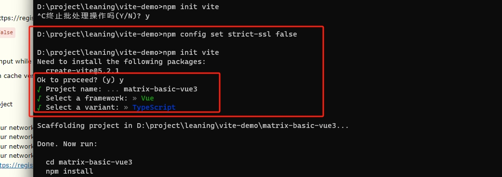
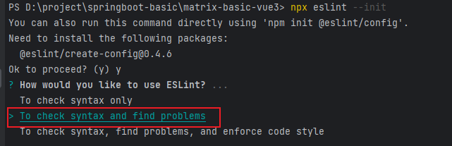
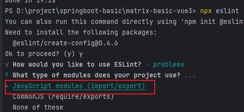
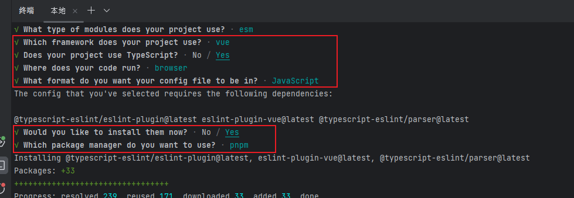
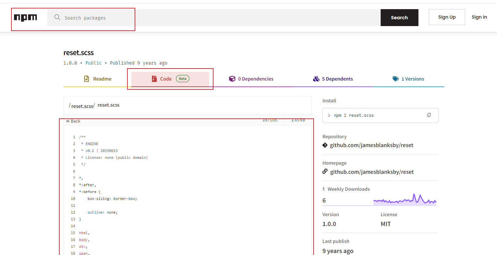

# 小技巧

## 路径报错

尝试重启webstrom

# 项目初始化

## 环境

`node 18.16.0`

`npm  9.6.7`

## 框架技术

###### `Vue3`

###### `element-plus`

###### `ts`

###### `pnpm`包管理工具

注意使用`pnpm install`的命令

###### `vite` 工具链

###### `eslint`

## 框架初始化

### 环境配置

#### 安装`pnpm`

`npm i -g pnpm`

#### `vite`构建项目

执行下面之前可能需要执行 `npm config set strict-ssl false`

`npm init vite` 或者 `pnpm create vite`



### 项目配置

#### 插件配置

##### `eslint`配置

###### 安装`eslint`

`pnpm i eslint -D`

###### 生成配置文件:`.eslint.cjs`

`npx eslint --init`







###### .eslint.cjs配置文件

```js
module.exports = {
  //运行环境
  env: {
    browser: true, //浏览器端
    es2021: true, //es2021
  },
  //规则继承
  extends: [
    //全部规则默认是关闭的,这个配置项开启推荐规则,推荐规则参照文档
    //比如:函数不能重名、对象不能出现重复key
    'eslint:recommended',
    //vue3语法规则
    'plugin:vue/vue3-essential',
    //ts语法规则
    'plugin:@typescript-eslint/recommended',
  ],
  //要为特定类型的文件指定处理器
  overrides: [],
  //指定解析器:解析器
  //Esprima 默认解析器
  //Babel-ESLint babel解析器
  //@typescript-eslint/parser ts解析器  (现在放入到parserOptions中了)
  parser: '@typescript-eslint/parser',
  //指定解析器选项
  parserOptions: {
    ecmaVersion: 'latest', //校验ECMA最新版本
    sourceType: 'module', //设置为"script"（默认），或者"module"代码在ECMAScript模块中
  },
  //ESLint支持使用第三方插件。在使用插件之前，您必须使用npm安装它
  //该eslint-plugin-前缀可以从插件名称被省略
  plugins: ['vue', '@typescript-eslint'],
  //eslint规则
  rules: {},
}
```

###### vue3环境代码校验插件

```
# 让所有与prettier规则存在冲突的Eslint rules失效，并使用prettier进行代码检查
"eslint-config-prettier": "^8.6.0",
"eslint-plugin-import": "^2.27.5",
"eslint-plugin-node": "^11.1.0",
# 运行更漂亮的Eslint，使prettier规则优先级更高，Eslint优先级低
"eslint-plugin-prettier": "^4.2.1",
# vue.js的Eslint插件（查找vue语法错误，发现错误指令，查找违规风格指南
"eslint-plugin-vue": "^9.9.0",
# 该解析器允许使用Eslint校验所有babel code
"@babel/eslint-parser": "^7.19.1",
```

安装指令

```
pnpm install -D eslint-plugin-import eslint-plugin-vue eslint-plugin-node eslint-plugin-prettier eslint-config-prettier eslint-plugin-node @babel/eslint-parser
```

###### 修改.eslintrc.cjs配置文件

直接替换即可

```javascript
// @see https://eslint.bootcss.com/docs/rules/

module.exports = {
  env: {
    browser: true,
    es2021: true,
    node: true,
    jest: true,
  },
  /* 指定如何解析语法 */
  parser: 'vue-eslint-parser',
  /** 优先级低于 parse 的语法解析配置 */
  parserOptions: {
    ecmaVersion: 'latest',
    sourceType: 'module',
    parser: '@typescript-eslint/parser',
    jsxPragma: 'React',
    ecmaFeatures: {
      jsx: true,
    },
  },
  /* 继承已有的规则 */
  extends: [
    'eslint:recommended',
    'plugin:vue/vue3-essential',
    'plugin:@typescript-eslint/recommended',
    'plugin:prettier/recommended',
  ],
  plugins: ['vue', '@typescript-eslint'],
  /*
   * "off" 或 0    ==>  关闭规则
   * "warn" 或 1   ==>  打开的规则作为警告（不影响代码执行）
   * "error" 或 2  ==>  规则作为一个错误（代码不能执行，界面报错）
   */
  rules: {
    // eslint（https://eslint.bootcss.com/docs/rules/）
    'no-var': 'error', // 要求使用 let 或 const 而不是 var
    'no-multiple-empty-lines': ['warn', { max: 1 }], // 不允许多个空行
    'no-console': process.env.NODE_ENV === 'production' ? 'error' : 'off',
    'no-debugger': process.env.NODE_ENV === 'production' ? 'error' : 'off',
    'no-unexpected-multiline': 'error', // 禁止空余的多行
    'no-useless-escape': 'off', // 禁止不必要的转义字符

    // typeScript (https://typescript-eslint.io/rules)
    '@typescript-eslint/no-unused-vars': 'error', // 禁止定义未使用的变量
    '@typescript-eslint/prefer-ts-expect-error': 'error', // 禁止使用 @ts-ignore
    '@typescript-eslint/no-explicit-any': 'off', // 禁止使用 any 类型
    '@typescript-eslint/no-non-null-assertion': 'off',
    '@typescript-eslint/no-namespace': 'off', // 禁止使用自定义 TypeScript 模块和命名空间。
    '@typescript-eslint/semi': 'off',

    // eslint-plugin-vue (https://eslint.vuejs.org/rules/)
    'vue/multi-word-component-names': 'off', // 要求组件名称始终为 “-” 链接的单词
    'vue/script-setup-uses-vars': 'error', // 防止<script setup>使用的变量<template>被标记为未使用
    'vue/no-mutating-props': 'off', // 不允许组件 prop的改变
    'vue/attribute-hyphenation': 'off', // 对模板中的自定义组件强制执行属性命名样式
  },
}
```

###### .eslintignore忽略文件

哪些文件中的代码不需要校验

```
dist
node_modules
```

###### 新增运行脚本

在`package.json`中新增运行脚本

`lint` 校验`src`中的语法，`fix` 纠正 `src` 中的语法。 (下边的prettier也是用这个)

```json
"scripts": {
    "lint": "eslint src",
    "fix": "eslint src --fix",
}
```

##### 配置prettier

eslint针对的是javascript，他是一个检测工具，包含js语法以及少部分格式问题，在eslint看来，语法对了就能保证代码正常运行，格式问题属于其次；
而prettier属于格式化工具，它看不惯格式不统一，所以它就把eslint没干好的事接着干，另外，prettier支持包含js在内的多种语言。

总结起来，**eslint和prettier这俩兄弟一个保证js代码质量，一个保证代码美观。**

###### 安装依赖包

```
pnpm install -D eslint-plugin-prettier prettier eslint-config-prettier
```

###### `.prettierrc.json`添加规则

`"singleQuote": true` 字符串必须都是单引号
`"semi": false` 语句后边不需要加分号
`"tabWidth": 2` 缩进是两个空格

```json
{
  "singleQuote": true,
  "semi": false,
  "bracketSpacing": true,
  "htmlWhitespaceSensitivity": "ignore",
  "endOfLine": "auto",
  "trailingComma": "all",
  "tabWidth": 2
}
```

###### `.prettierignore`忽略文件

```
/dist/*
/html/*
.local
/node_modules/**
**/*.svg
**/*.sh
/public/*
```

##### 配置`stylelint`

[stylelint](https://stylelint.io/)为css的lint工具。可格式化css代码，检查css语法错误与不合理的写法，指定css书写顺序等。

###### 安装

我们的项目中使用scss作为预处理器，安装以下依赖：

```
pnpm add sass sass-loader stylelint postcss postcss-scss postcss-html stylelint-config-prettier stylelint-config-recess-order stylelint-config-recommended-scss stylelint-config-standard stylelint-config-standard-vue stylelint-scss stylelint-order stylelint-config-standard-scss -D
```

###### `.stylelintrc.cjs`配置文件

**官网:https://stylelint.bootcss.com/**

```js
// @see https://stylelint.bootcss.com/

module.exports = {
  extends: [
    'stylelint-config-standard', // 配置stylelint拓展插件
    'stylelint-config-html/vue', // 配置 vue 中 template 样式格式化
    'stylelint-config-standard-scss', // 配置stylelint scss插件
    'stylelint-config-recommended-vue/scss', // 配置 vue 中 scss 样式格式化
    'stylelint-config-recess-order', // 配置stylelint css属性书写顺序插件,
    'stylelint-config-prettier', // 配置stylelint和prettier兼容
  ],
  overrides: [
    {
      files: ['**/*.(scss|css|vue|html)'],
      customSyntax: 'postcss-scss',
    },
    {
      files: ['**/*.(html|vue)'],
      customSyntax: 'postcss-html',
    },
  ],
  ignoreFiles: [
    '**/*.js',
    '**/*.jsx',
    '**/*.tsx',
    '**/*.ts',
    '**/*.json',
    '**/*.md',
    '**/*.yaml',
  ],
  /**
   * null  => 关闭该规则
   * always => 必须
   */
  rules: {
    'value-keyword-case': null, // 在 css 中使用 v-bind，不报错
    'no-descending-specificity': null, // 禁止在具有较高优先级的选择器后出现被其覆盖的较低优先级的选择器
    'function-url-quotes': 'always', // 要求或禁止 URL 的引号 "always(必须加上引号)"|"never(没有引号)"
    'no-empty-source': null, // 关闭禁止空源码
    'selector-class-pattern': null, // 关闭强制选择器类名的格式
    'property-no-unknown': null, // 禁止未知的属性(true 为不允许)
    'block-opening-brace-space-before': 'always', //大括号之前必须有一个空格或不能有空白符
    'value-no-vendor-prefix': null, // 关闭 属性值前缀 --webkit-box
    'property-no-vendor-prefix': null, // 关闭 属性前缀 -webkit-mask
    'selector-pseudo-class-no-unknown': [
      // 不允许未知的选择器
      true,
      {
        ignorePseudoClasses: ['global', 'v-deep', 'deep'], // 忽略属性，修改element默认样式的时候能使用到
      },
    ],
  },
}
```

###### `.stylelintignore`忽略文件

```
/node_modules/*
/dist/*
/html/*
/public/*
```

###### 新增运行脚本

主要是下边三个，其他的在之前都有了

format：格式化 `html,vue,ts,js,json,md` 的代码

```json
 "scripts": {
    "dev": "vite --open",
    "build": "vue-tsc && vite build",
    "preview": "vite preview",
    "lint": "eslint src",
    "fix": "eslint src --fix",
    "format": "prettier --write \"./**/*.{html,vue,ts,js,json,md}\"",
    "lint:eslint": "eslint src/**/*.{ts,vue} --cache --fix",
    "lint:style": "stylelint src/**/*.{css,scss,vue} --cache --fix"
  },
```

**当我们运行`pnpm run format`的时候，会把代码直接格式化**

##### 配置husky

在上面我们已经集成好了我们代码校验工具，但是需要每次手动的去执行命令才会格式化我们的代码。如果有人没有格式化就提交了远程仓库中，那这个规范就没什么用。所以我们需要强制让开发人员按照代码规范来提交。

要做到这件事情，就需要利用husky在代码提交之前触发git hook(git在客户端的钩子)，然后执行`pnpm run format`来自动的格式化我们的代码。

###### 安装`husky`

```
pnpm install -D husky
```

###### 配置

执行 `npx husky-init`

会在根目录下生成个一个.husky目录，在这个目录下面会有一个pre-commit文件，这个文件里面的命令在我们执行commit的时候就会执行

在`.husky/pre-commit`文件添加如下命令：

```
#!/usr/bin/env sh
. "$(dirname -- "$0")/_/husky.sh"
pnpm run format
```

当我们对代码进行commit操作的时候，就会执行命令，对代码进行格式化，然后再提交。

##### 配置commitlint

对于我们的commit信息，也是有统一规范的，不能随便写,要让每个人都按照统一的标准来执行，我们可以利用**commitlint**来实现。

###### 安装

```
pnpm add @commitlint/config-conventional @commitlint/cli -D
```

###### 配置

添加文件，新建`commitlint.config.cjs`(注意是cjs)，然后添加下面的代码：

```
module.exports = {
  extends: ['@commitlint/config-conventional'],
  // 校验规则
  rules: {
    'type-enum': [
      2,
      'always',
      [
        'feat',
        'fix',
        'docs',
        'style',
        'refactor',
        'perf',
        'test',
        'chore',
        'revert',
        'build',
      ],
    ],
    'type-case': [0],
    'type-empty': [0],
    'scope-empty': [0],
    'scope-case': [0],
    'subject-full-stop': [0, 'never'],
    'subject-case': [0, 'never'],
    'header-max-length': [0, 'always', 72],
  },
}
```

在`package.json`中配置scripts命令

```json
{
  "scripts": {
    "commitlint": "commitlint --config commitlint.config.cjs -e -V"
  }
}
```

配置结束，现在当我们填写`commit`信息的时候，前面就需要带着下面的`subject`

```
'feat',//新特性、新功能
'fix',//修改bug
'docs',//文档修改
'style',//代码格式修改, 注意不是 css 修改
'refactor',//代码重构
'perf',//优化相关，比如提升性能、体验
'test',//测试用例修改
'chore',//其他修改, 比如改变构建流程、或者增加依赖库、工具等
'revert',//回滚到上一个版本
'build',//编译相关的修改，例如发布版本、对项目构建或者依赖的改动
```

###### 配置husky

`npx husky add .husky/commit-msg`

在生成的commit-msg文件中添加下面的命令

```
#!/usr/bin/env sh
. "$(dirname -- "$0")/_/husky.sh"
pnpm commitlint
```

当我们 commit 提交信息时，就不能再随意写了，必须是 git commit -m 'fix: xxx' 符合类型的才可以，**需要注意的是类型的后面需要用英文的 :，并且冒号后面是需要空一格的，这个是不能省略的**

#### 功能配置

##### 运行自动打开

`package.json`中 加 `--open` 代表运行后会自动打开浏览器

```json
  "scripts": {
    "dev": "vite --open",
    "build": "vue-tsc && vite build",
    "preview": "vite preview"
  },
```

### 项目集成

#### 组件库`element-plus`

##### 安装`element-plus`

`pnpm install element-plus`

配置`main.ts`

```ts
import { createApp } from 'vue'
import App from './App.vue'
import ElementPlus from 'element-plus' // 此处
import 'element-plus/dist/index.css' // 此处

createApp(App)
  // 此处
  .use(ElementPlus)
  .mount('#app')
```

##### 安装`element-plus`图标

`pnpm i @element-plus/icons-vue`

**入口文件`main.ts`全局安装element-plus,element-plus默认支持语言英语设置为中文**

```ts
import ElementPlus from 'element-plus'
import 'element-plus/dist/index.css'
//@ts-ignore忽略当前文件ts类型的检测否则有红色提示(打包会失败)
import zhCn from 'element-plus/dist/locale/zh-cn.mjs'

app.use(ElementPlus, {
  locale: zhCn,
})
```

##### Element Plus全局组件类型声明

```json
// tsconfig.json
{
  "compilerOptions": {
    // ...
    "types": ["element-plus/global"]
  }
}
```

配置完毕可以测试element-plus组件与图标的使用.

#### `src`别名的配置(好东西)

在开发项目的时候文件与文件关系可能很复杂，因此我们需要给src文件夹配置一个别名！！！

```ts
// vite.config.ts
import { defineConfig } from 'vite'
import vue from '@vitejs/plugin-vue'
import path from 'path'
export default defineConfig({
  plugins: [vue()],
  resolve: {
    alias: {
      '@': path.resolve('./src'), // 相对路径别名配置，使用 @ 代替 src
    },
  },
})
```

##### TypeScript 编译配置

```json
// tsconfig.json
{
  "compilerOptions": {
    "baseUrl": "./", // 解析非相对模块的基地址，默认是当前目录
    "paths": {
      //路径映射，相对于baseUrl
      "@/*": ["src/*"]
    }
  }
}
```

然后可能需要重启一下webstorm

#### 环境变量(重要)

##### 简介

**项目开发过程中，至少会经历开发环境、测试环境和生产环境(即正式环境)三个阶段。不同阶段请求的状态(如接口地址等)不尽相同，若手动切换接口地址是相当繁琐且易出错的。于是环境变量配置的需求就应运而生，我们只需做简单的配置，把环境状态切换的工作交给代码。**

开发环境（development）
顾名思义，开发使用的环境，每位开发人员在自己的dev分支上干活，开发到一定程度，同事会合并代码，进行联调。

测试环境（testing）
测试同事干活的环境啦，一般会由测试同事自己来部署，然后在此环境进行测试

生产环境（production）
生产环境是指正式提供对外服务的，一般会关掉错误报告，打开错误日志。(正式提供给客户使用的环境。)

注意:一般情况下，一个环境对应一台服务器,也有的公司开发与测试环境是一台服务器！！！

项目根目录分别添加 开发、生产和测试环境的文件!

##### 创建文件

```
.env.development
.env.production
.env.test
```

##### 各个文件内容

`.env.development`

```
# 变量必须以 VITE_ 为前缀才能暴露给外部读取
NODE_ENV = 'development'
VITE_APP_TITLE = 'matrix-software'
VITE_APP_BASE_API = '/liu'
VITE_SERVE = 'http://127.0.0.1:9090'
```

`.env.production`

```
# 变量必须以 VITE_ 为前缀才能暴露给外部读取
NODE_ENV = 'production'
VITE_APP_TITLE = 'matrix-software'
VITE_APP_BASE_API = 'http://127.0.0.1:9090/liu'
```

`.env.test`

```
# 变量必须以 VITE_ 为前缀才能暴露给外部读取
NODE_ENV = 'test'
VITE_APP_TITLE = 'matrix-software'
VITE_APP_BASE_API = 'http://127.0.0.1:9090/liu'
```

##### 配置运行命令 `package.json`

注意 `--mode` 后的内容

```json
 "scripts": {
    "dev": "vite --open",
    "build:test": "vue-tsc && vite build --mode test",
    "build:pro": "vue-tsc && vite build --mode production",
    "preview": "vite preview"
  },
```

<font color="gree">通过`import.meta.env`获取环境变量</font>

```ts
const a = import.meta.env
console.log(a)
```

#### SVG图标配置(不错)

在开发项目的时候经常会用到`svg`矢量图,而且我们使用SVG以后，页面上加载的不再是图片资源,

这对页面性能来说是个很大的提升，而且我们SVG文件比`img`要小的很多，放在项目中几乎不占用资源。

##### 安装SVG依赖插件

`pnpm install vite-plugin-svg-icons -D`

##### 在`vite.config.ts`中配置插件

```ts
import { createSvgIconsPlugin } from 'vite-plugin-svg-icons'
import path from 'path'
export default () => {
  return {
    plugins: [
      createSvgIconsPlugin({
        // Specify the icon folder to be cached(svg适量图标存放目录)
        iconDirs: [path.resolve(process.cwd(), 'src/assets/icons')],
        // Specify symbolId format
        symbolId: 'icon-[dir]-[name]',
      }),
    ],
  }
}
```

##### `main.ts`入口文件导入

```ts
import 'virtual:svg-icons-register'
```

##### 测试

直接复制阿里矢量图标库中的`svg`码，在`src/assets/icons`目录下新建文件 `.svg` 将`svg`码复制进改文件

```vue
<template>
  <div>
    <h1>svg测试</h1>
    <svg style="width: 30px;height: 30px">
      <!-- 必须以#icon-开头，后边是是命名的svg文件名 -->
      <use xlink:href="#icon-monitor" fill="blue"></use>
    </svg>
  </div>
</template>
```

##### `svg`封装为组件(可以)

在src/components目录下创建一个SvgIcon组件:代表如下

```vue
<template>
  <div>
    <svg :style="{ width: width, height: height }">
      <use :xlink:href="prefix + name" :fill="color"></use>
    </svg>
  </div>
</template>
<script setup lang="ts">
defineProps({
  //xlink:href属性值的前缀
  prefix: {
    type: String,
    default: '#icon-',
  },
  //svg矢量图的名字
  name: String,
  //svg图标的颜色
  color: {
    type: String,
    default: '',
  },
  //svg宽度
  width: {
    type: String,
    default: '16px',
  },
  //svg高度
  height: {
    type: String,
    default: '16px',
  },
})
</script>
<style scoped></style>
```

测试

```vue
<template>
  <div>
    <h1>svg测试</h1>
    <svg-icon name="home" color="red"></svg-icon>
  </div>
</template>

<script setup lang="ts">
import SvgIcon from '@/components/SvgIcon/index.vue'
</script>

<style scoped></style>
```

##### `svg`封装为全局组件(可以)

`main.ts`中

```ts
import { createApp } from 'vue'
import App from './App.vue'
import ElementPlus from 'element-plus'
import 'element-plus/dist/index.css'
//@ts-ignore忽略当前文件ts类型的检测否则有红色提示(打包会失败)
import zhCn from 'element-plus/dist/locale/zh-cn.mjs'
import 'virtual:svg-icons-register'
import SvgIcon from '@/components/SvgIcon/index.vue' // 此处

createApp(App)
  .use(ElementPlus, {
    locale: zhCn,
  })
  // SvgIcon 注册为全局组件 此处
  .component('SvgIcon', SvgIcon)
  .mount('#app')
```

测试

```vue
<template>
  <div>
    <h1>svg测试</h1>
    <svg-icon name="home" color="red"></svg-icon>
  </div>
</template>
<!-- 此时不需要引入 -->
<script setup lang="ts"></script>
<style scoped></style>
```

#### 将所有组件变成全局组件(可以)

在`src`文件夹目录下创建一个`index.ts`文件：用于注册components文件夹内部全部全局组件！！！

```ts
// 想成为全局组件的在此引入
import SvgIcon from './SvgIcon/index.vue'
import type { App, Component } from 'vue'
// 想成为全局组件的添加到此
const components: { [name: string]: Component } = { SvgIcon }
// 对外暴露插件对象
export default {
  // 务必叫 install 方法
  install(app: App) {
    Object.keys(components).forEach((key: string) => {
      app.component(key, components[key])
    })
  },
}
```

在入口文件引入src/index.ts文件,通过app.use方法安装自定义插件

```ts
import gloablComponent from './components/index'
app.use(gloablComponent)
```

#### 集成sass

是世界上最成熟、最稳定、最强大的专业级CSS扩展语言！Sass完全兼容所有版本的CSS。

我们目前在组件内部已经可以使用`scss`样式,因为在配置`styleLint`工具的时候，项目当中已经安装过`sass sass-loader`,因此我们再组件内可以使用`scss`语法！！！需要加上`lang="scss"`

```vue
<style scoped lang="scss"></style>
```

##### 项目添加全局样式(可用于设置主题)

在`src/styles`目录下创建一个`index.scss`文件，当然项目中需要用到**清除默认样式**，因此在`index.scss`引入`reset.scss` (需要在styles目录下创建`reset.scss` 文件并将在`npm`官网中复制的`reset.scss`的代码复制进里面)



```scss
@import './reset.scss';
```

`main.ts`文件引入

```ts
import '@/styles/index.scss'
```

但是你会发现在`src/styles/index.scss`全局样式文件中**没有办法使用$变量**.因此需要给项目中引入全局变量$.

在`styles/variable.scss`创建一个`variable.scss`文件！

在`vite.config.ts`文件配置如下:

```ts
export default defineConfig((config) => {
	css: {
      preprocessorOptions: {
        scss: {
          javascriptEnabled: true,
          additionalData: '@import "./src/styles/variable.scss";',
        },
      },
    },
	}
}
```

##### 测试

`variable.scss`中

```scss
$color: red;
```

`app.vue`中

```vue
<template>
  <div>
    <h1 class="h1">svg测试</h1>
  </div>
</template>
<script setup lang="ts"></script>
<style scoped lang="scss">
.h1 {
  color: $color;
}
</style>
```

#### mock数据

使用mock，制造模拟数据，模拟后端。

https://www.npmjs.com/package/vite-plugin-mock

##### 安装配置

`pnpm install -D vite-plugin-mock mockjs`

在 vite.config.js 配置文件启用插件。

```js
import { UserConfigExport, ConfigEnv } from 'vite'
import { viteMockServe } from 'vite-plugin-mock'
import vue from '@vitejs/plugin-vue'
// 注意方式改为了箭头函数
export default ({ command }) => {
  return {
    plugins: [
      vue(),
      viteMockServe({
        // localEnabled: command === 'serve', // 开发阶段可以使用mock接口localEnabled可能爆红但不影响运行
        // 换回2.9.8版本不爆红但是，启动有黄色警报
        enable: true, // 3.0.0以上版本用这个即可(github上的新解释)
        // https://github.com/vbenjs/vite-plugin-mock/blob/main/README.zh_CN.md
      }),
    ],
  }
}
```

在根目录创建mock文件夹:去创建我们需要mock数据与接口！！！

在mock文件夹内部创建一个user.ts文件

```ts
//用户信息数据
function createUserList() {
  return [
    {
      userId: 1,
      avatar:
        'https://wpimg.wallstcn.com/f778738c-e4f8-4870-b634-56703b4acafe.gif',
      username: 'admin',
      password: '111111',
      desc: '平台管理员',
      roles: ['平台管理员'],
      buttons: ['cuser.detail'],
      routes: ['home'],
      token: 'Admin Token',
    },
    {
      userId: 2,
      avatar:
        'https://wpimg.wallstcn.com/f778738c-e4f8-4870-b634-56703b4acafe.gif',
      username: 'system',
      password: '111111',
      desc: '系统管理员',
      roles: ['系统管理员'],
      buttons: ['cuser.detail', 'cuser.user'],
      routes: ['home'],
      token: 'System Token',
    },
  ]
}

export default [
  // 用户登录接口
  {
    url: '/api/user/login', //请求地址
    method: 'post', //请求方式
    response: ({ body }) => {
      //获取请求体携带过来的用户名与密码
      const { username, password } = body
      //调用获取用户信息函数,用于判断是否有此用户
      const checkUser = createUserList().find(
        (item) => item.username === username && item.password === password,
      )
      //没有用户返回失败信息
      if (!checkUser) {
        return { code: 201, data: { message: '账号或者密码不正确' } }
      }
      //如果有返回成功信息
      const { token } = checkUser
      return { code: 200, data: { token } }
    },
  },
  // 获取用户信息
  {
    url: '/api/user/info',
    method: 'get',
    response: (request) => {
      //获取请求头携带token
      const token = request.headers.token
      //查看用户信息是否包含有次token用户
      const checkUser = createUserList().find((item) => item.token === token)
      //没有返回失败的信息
      if (!checkUser) {
        return { code: 201, data: { message: '获取用户信息失败' } }
      }
      //如果有返回成功信息
      return { code: 200, data: { checkUser } }
    },
  },
]
```

##### 测试

安装axios

`pnpm install axios`

测试接口main.ts中

```ts
import { createApp } from 'vue'
import App from './App.vue'
import ElementPlus from 'element-plus'
import 'element-plus/dist/index.css'
//@ts-ignore忽略当前文件ts类型的检测否则有红色提示(打包会失败)
import zhCn from 'element-plus/dist/locale/zh-cn.mjs'
import 'virtual:svg-icons-register'
import gloablComponent from '@/components/index'
import '@/styles/index.scss'

// 测试mock接口能否使用
import axios from 'axios'
axios({
  url: '/api/user/login',
  method: 'post',
  data: {
    username: 'admin',
    password: '111111',
  },
})

createApp(App)
  .use(ElementPlus, {
    locale: zhCn,
  })
  // SvgIcon 注册为全局组件
  .use(gloablComponent)
  .mount('#app')
```

直接刷新主页发现登录成功**可行**！！

#### axios二次封装(重要)

目的:

1:使用请求拦截器，可以在请求拦截器中处理一些业务(开始进度条、_请求头携带公共参数_ )
2:使用响应拦截器，可以在响应拦截器中处理一些业务(进度条结束、简化服务器返回的数据、处理http网络错误)

创建`src/utils`目录， 创建`request.ts`文件：

```ts
// 进行axios的二次封装, 使用请求和响应拦截器
import axios from 'axios'
import { ElMessage } from 'element-plus'
// 一、利用axios对象的create方法创建axios的实例(配置其他配置: 基础路径、超时时间)
let request = axios.create({
  /**
   * 基础路径　要让import.meta.env不报错 tsconfig.json中修改两项：
   * "module": "es2020",
   * "moduleResolution": "Node",
   */
  baseURL: import.meta.env.VITE_APP_BASE_API,
  // 超时时间 10s
  timeout: 10000,
})
// 二、request添加请求与响应拦截器
request.interceptors.request.use((config) => {
  // config配置对象，headers属性请求头，经常给服务器端携带公共参数
  // 返回配置对象
  return config
})
request.interceptors.response.use(
  // 成功的回调
  (response) => {
    // 简化数据
    return response.data
  },
  // 失败的回调
  (error) => {
    // 处理http网络错误
    // 顶一个变量:存储网络错误的信息
    let message = ''
    // http 状态码
    let status = error.response.status
    switch (status) {
      case 401:
        message = 'token过期'
        break
      case 403:
        message = '无权访问'
        break
      case 404:
        message = '请求地址错误'
        break
      case 500:
        message = '服务器出现问题'
        break
      default:
        message = '网络出现问题'
    }
    // 提示的错误信息
    ElMessage({
      type: 'error',
      message,
    })
    // 终结Promise量
    return Promise.reject(error)
  },
)
// 对外暴露request
export default request
```

测试app.vue

刷新首页即可

```vue
<template>
  <div>
    <h1 class="h1">测试axios封装</h1>
  </div>
</template>

<script setup lang="ts">
import request from '@/utils/request.ts'
import { onMounted } from 'vue'

onMounted(() => {
  request({
    url: '/user/login',
    method: 'POST',
    data: {
      username: 'admin',
      password: '111111',
    },
  }).then((res) => {
    console.log(res)
  })
})
</script>
<style scoped lang="scss"></style>
```

#### api接口统一管理(重要)

在开发项目的时候,接口可能很多需要统一管理。在src目录下去创建api文件夹去统一管理项目的接口；

示例

`type.ts`类型

```ts
// 登录接口携带参数类型
export interface loginFrom {
  username: string
  password: string
}

interface dataType {
  token: string
}

// 登录接口返回的数据类型
export interface loginResponseData {
  code: number
  data: dataType
}

interface userInfo {
  userId: number
  avatar: string
  username: string
  password: string
  desc: string
  roles: Array<string>
  button: Array<string>
  routes: Array<string>
  token: string
}

interface user {
  checkUser: userInfo
}

// 定义服务器返回用户信息相关的数据类型
export interface userResponseData {
  code: number
  data: user
}
```

`index.ts`中

```ts
// 统一管理用户相关的接口
import request from '@/utils/request.ts'
import {
  loginFrom,
  loginResponseData,
  userResponseData,
} from '@/api/user/type.ts'

enum API {
  LOGIN_URL = '/user/login',
  USER_INFO_URL = '/user/info',
}
// 对外暴露请求函数
export const reqLogin = (data: loginFrom) =>
  request.post<any, loginResponseData>(API.LOGIN_URL, data)
export const reqUserInfo = () =>
  request.get<userResponseData>(API.USER_INFO_URL)
```

测试

```vue
<template>
  <div>
    <h1 class="h1">app根组件</h1>
  </div>
</template>

<script setup lang="ts">
import { onMounted } from 'vue'
import { reqLogin } from '@/api/user'

onMounted(() => {
  reqLogin({ username: 'admin', password: '111111' })
})
</script>

<style scoped lang="scss"></style>
```

成功运行

#### 路由`vue-router`

开发环境

`pnpm install vue-router`

src下创建 router目录 下创建 `routes.ts` 与 `index.ts` 文件

routes.ts中

```ts
// 对外暴露配置路由 常量路由
export const constantRoute = [
  {
    path: '/login',
    component: () => import('@/views/login/index.vue'),
    name: 'login', // 命名路由 以后做权限使用
  },
  {
    path: '/',
    component: () => import('@/views/home/index.vue'),
    name: 'layout',
  },
  {
    path: '/404',
    component: () => import('@/views/404/index.vue'),
    name: '404',
  },
  {
    // 任意路由重定向到404
    path: '/:pathMatch(.*)*',
    redirect: '/404',
    name: 'Any',
  },
]
```

index.ts中

```ts
// 通过vue-router插件实现模板路由配置
import { createRouter, createWebHashHistory } from 'vue-router'
import { constantRoute } from '@/router/routes.ts'
// 创建路由器
let router = createRouter({
  // 路由模式hash
  history: createWebHashHistory(),
  routes: constantRoute,
  // 滚动行为
  scrollBehavior() {
    return {
      left: 0,
      top: 0,
    }
  },
})

export default router
```

#### 安装pinia

`pnpm i pinia`

##### 大仓库

src下创建store目录 `index.ts`

```ts
// 仓库大仓库
import { createPinia } from 'pinia'
// 创建大仓库
let pinia = createPinia()
// 对外暴露，入口文件需要安装仓库
export default pinia
```

`main.ts`

```ts
import pinia from '@/store'

createApp(App).use(pinia).mount('#app')
```

##### 小仓库

store目录下创建modules目录，下创建 `user.ts` :

```

```
